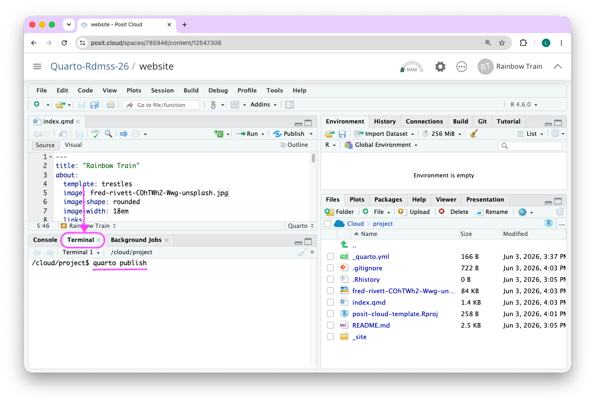
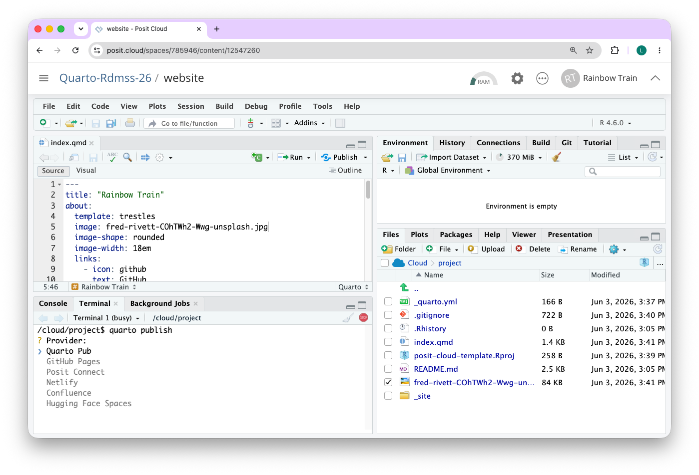
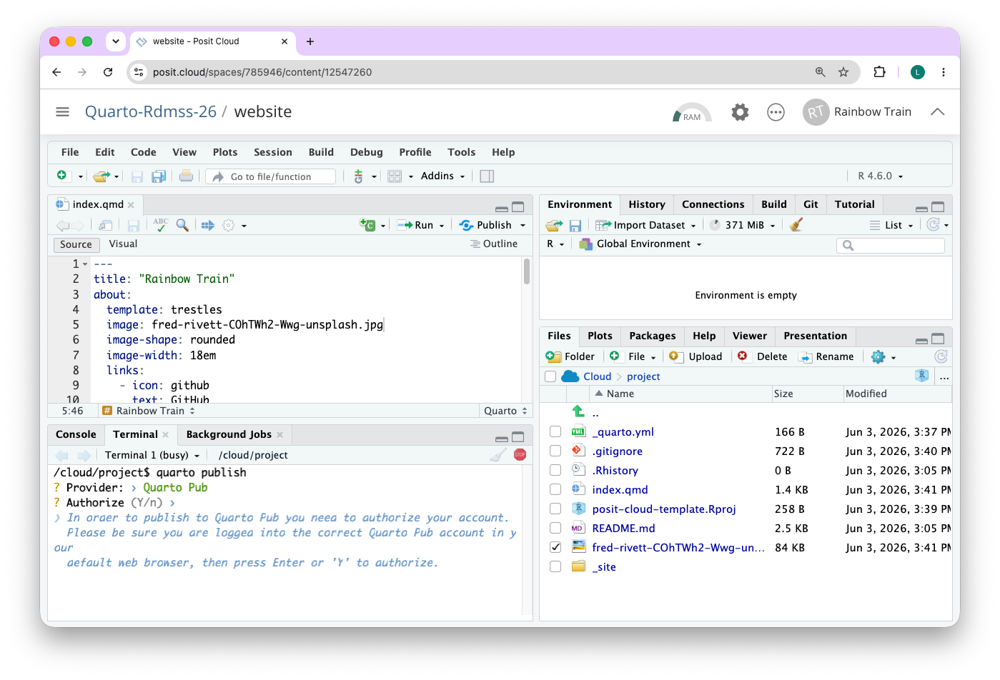
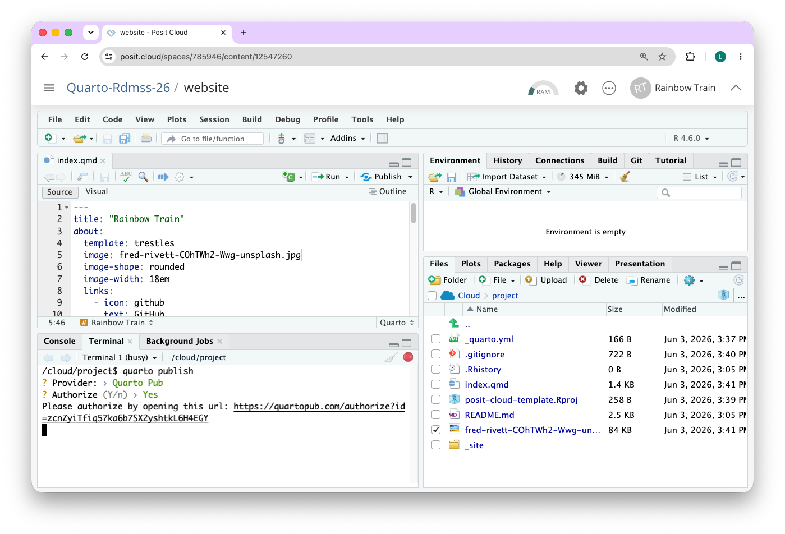
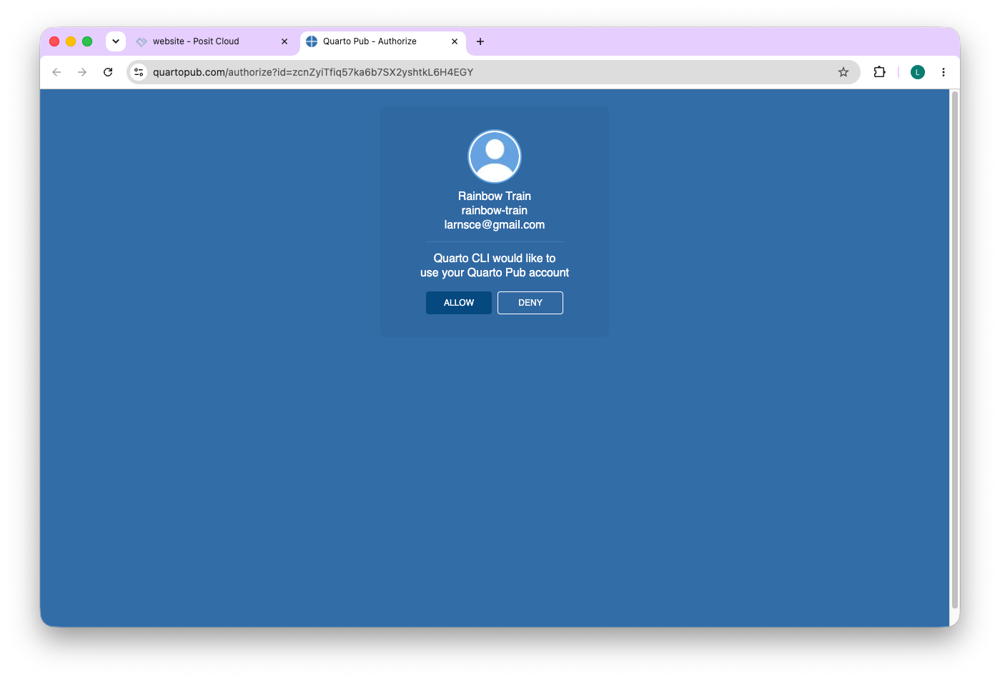
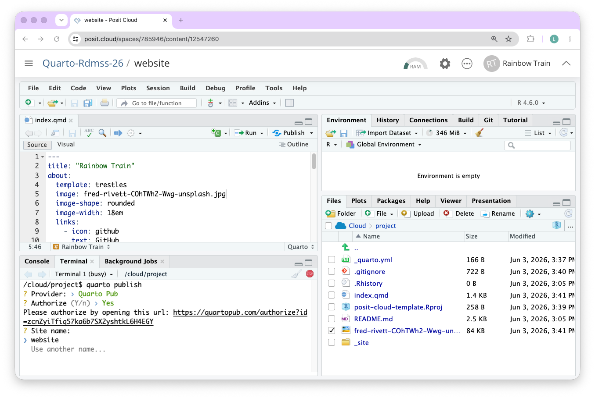
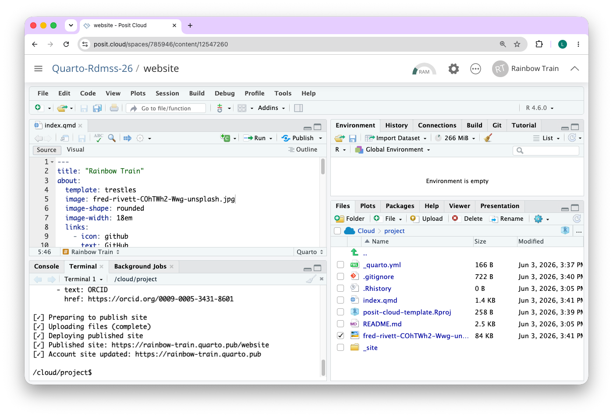
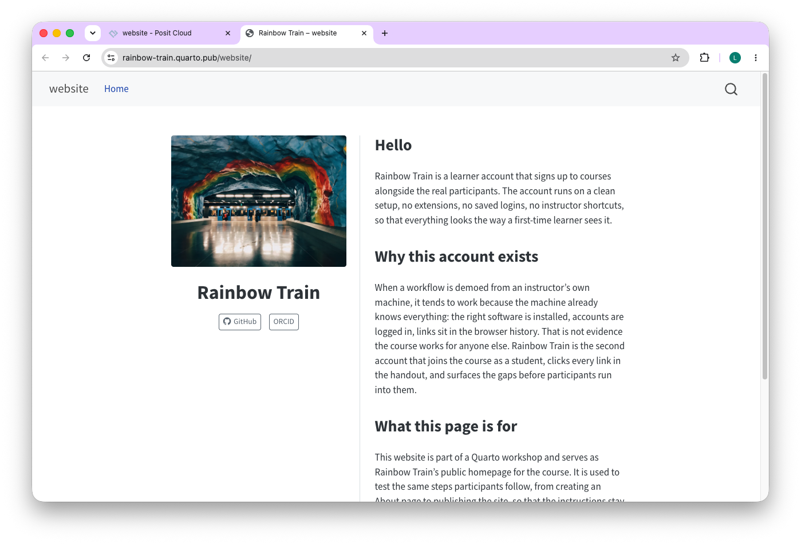
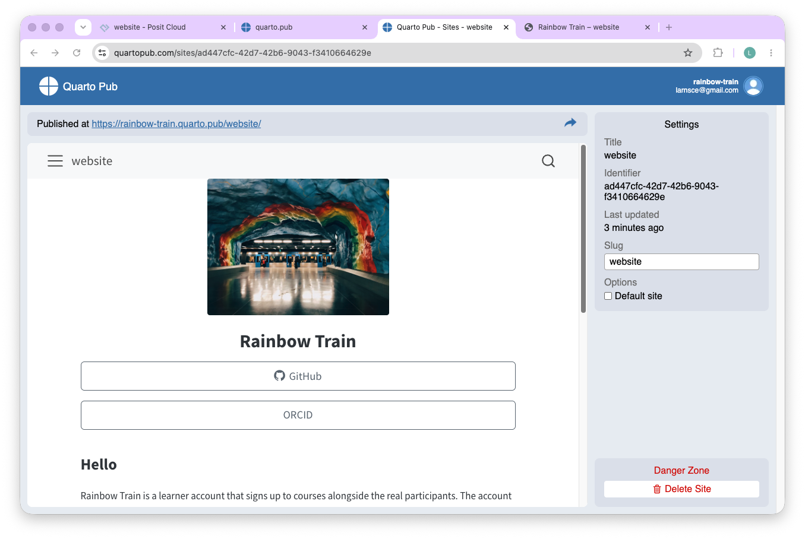

## What is an About page?

It's good practice for a website to have an About page. A lot of people look for this page when they first open a website and it can used to highlight the content of it or who you are. About pages in Quarto have some additional functionality that results in a nice layout and design. We will use the About page as the landing page (index) of your website.

In this task, it is up to you how much detail you would like to cover on this page. The idea is for this page to be front and center of your personal public homepage that we will to publish next week. Follow the steps below to create your About page.

If you have not yet done it, complete [Pre-work Step 5: About Page](../0-2-pre-work/05-about-page.html) first; the steps below build on the information you prepared there.

## Step 1 (part of pre-work)

- Collect links to your online profiles (e.g. GitHub, LinkedIn, ORCID, etc.)
- Write a short biography about yourself (1 paragraph, 2 two 3 sentences)
- Find a photo that you would like to show (can be portrait, can be a logo, can be a photo of something you like)

## Step 2 (live in workshop)

Write up your About page using the Quarto file format.

::: {.callout-note}
The screenshots below are taken from a different course. The steps are exactly the same, but where the screenshots show another workspace or project name, use `quarto-rdmss-26` instead.
:::

1. Open the "Content" page of the Posit Cloud workspace for the course: <https://posit.cloud/spaces/785946/content/>

2. Click on "New Project" button to create a new project

```{r}
knitr::include_graphics("images/01-website-new-project.png")
```

3. Click on "New RStudio Project"

```{r}
knitr::include_graphics("images/02-website-new-project-rstudio.png")
```

4. While the project deploys, rename it from "Untitled Project" to "website" by clicking on the "Untitled Project" text in the top-left corner of the RStudio window. You can also rename it after deployment has concluded.

```{r}
knitr::include_graphics("images/03-website-rename.png")
```

5. Create a Blank file using Quarto Document, name it `index.qmd` and save it in the root of the project.

```{r}
knitr::include_graphics("images/05-website-new-quarto-doc.png")
```

```{r}
knitr::include_graphics("images/06-website-name-index.png")
```

6. Open the `index.qmd` file and write up your page with guidance (e.g. copy/paste and replace) from  [Quarto documentation for About Pages](https://quarto.org/docs/websites/website-about.html)


```{r}
knitr::include_graphics("images/07-website-copy-about.png")
```

7. Render the `index.qmd` file to see what your website will look like

8. Keep updating the `index.qmd` until you are satisfied with the content and layout (e.g. try a different template, add your profile photo to the project folder, etc.)

## Step 3 (live in workshop)

Publish your About page to [Quarto Pub](https://quartopub.com/) so anyone with the link can view it.

Before you start, make sure you are signed in to Quarto Pub in your browser with the account you created in [Pre-work Assignment 3](../0-2-pre-work/03-quarto-pub.html). The browser authorisation step later in this section will use that signed-in account.

1. In the Terminal pane (bottom-left of RStudio), type `quarto publish` and press Enter.

```{r}

```

2. Pick `Quarto Pub` from the list of publishing destinations.

```{r}

```

3. Press `Y` to confirm that you want to authorise Quarto CLI to publish on your behalf.

```{r}

```

4. The Terminal prints a URL. Click the link to open it in your browser.

```{r}

```

5. In the browser, click **Allow** to grant Quarto CLI access to your Quarto Pub account.

```{r}

```

6. Back in the Terminal, accept the default site name (`website`) by pressing Enter.

```{r}

```

7. Quarto prepares, uploads, and deploys the site. When it is done, the Terminal prints the public URL.

```{r}

```

8. Open the URL in your browser to see your published About page.

```{r}

```

9. You can manage your site (rename, delete, see analytics) from your Quarto Pub dashboard at <https://quartopub.com/>.

```{r}

```

::: {.callout-tip}
After the first publish, Quarto creates a `_publish.yml` file in your project that remembers your site. To push updates later, just run `quarto publish` again from the Terminal; no need to re-authorise.
:::
